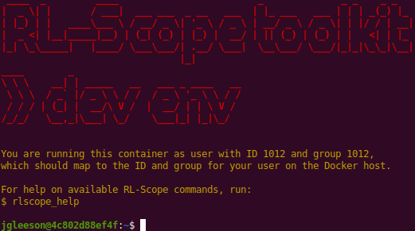
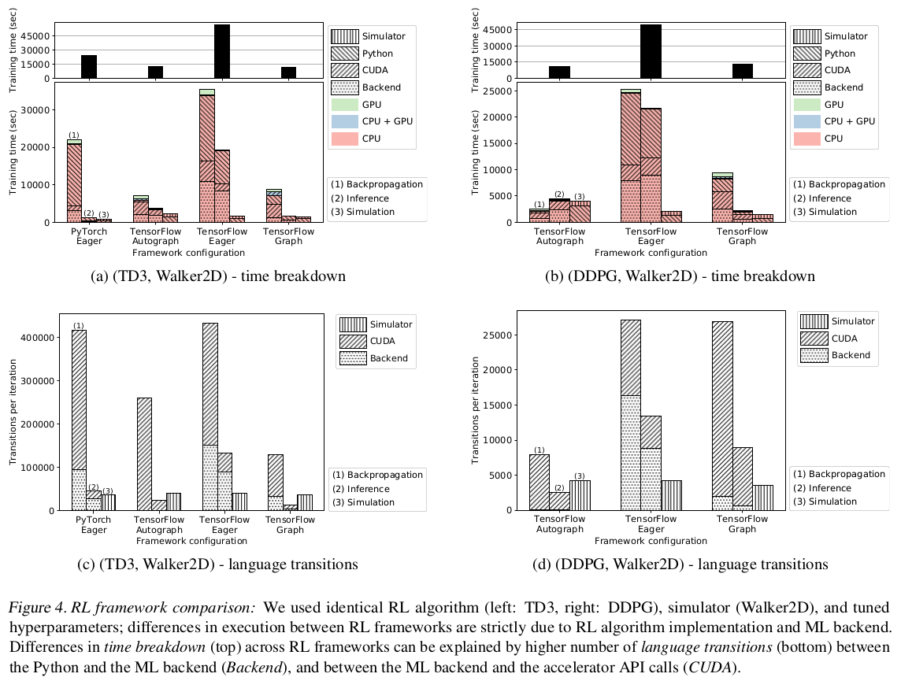
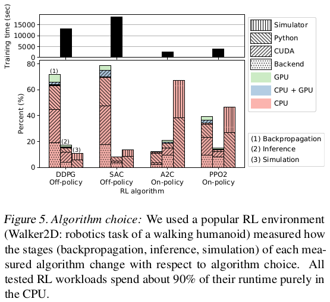
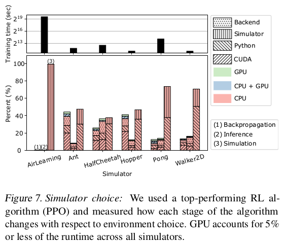

RL-Scope Artifact Evaluation
============================

This is a tutorial for reproducing figures in the RL-Scope paper.
To ease reproducibility, all experiments will run within a Docker development environment.

1. Machine configuration
------------------------
Generally speaking, RL-Scope works on multiple GPUs models.
The only limitation is that you need to use a GPU that supports the newer "CUPTI Profiling API".
`NVIDIA's documentation <https://docs.nvidia.com/cupti/Cupti/r_main.html#r_profiling_migration>`_
states that Volta and later GPU architectures
(i.e., devices with compute capability 7.0 and higher) should support this API.
If you attempt to use a GPU that is unsupported, the Docker build will fail, since
we check for CUPTI Profiling API compatibility using a sample program
(see :github:`dockerfiles/sh/test_cupti_profiler_api.sh`).

The machine we used in the RL-Scope paper had a NVIDIA 2080Ti GPU.
We have also reproduced results on an AWS
`g4dn.xlarge instance <https://aws.amazon.com/ec2/instance-types/g4>`_
which contains a T4 GPU.

AWS
^^^
As mentioned above, we have reproduced results on an AWS
`g4dn.xlarge instance <https://aws.amazon.com/ec2/instance-types/g4>`_
which contains a single T4 GPU.
Please note that the other AWS instances that have more than one GPU are also fine
(e.g., `g4dn.12xlarge, p3.8xlarge <https://aws.amazon.com/ec2/instance-types/#Accelerated_Computing>`_),
and will simply run the experiments faster by using multiple GPUs in parallel.

To make setup as simple as possible, we used
`NVIDIA's Deep Learning AMI <https://aws.amazon.com/marketplace/pp/B076K31M1S?ref_=srh_res_product_title>`_
to create an VM instance, which comes preinstalled with Ubuntu 18.04, Docker, and an NVIDIA driver.
If you wish to use a different OS image, just make sure you install the NVIDIA driver and Docker.

Regardless of the starting OS image you use, there is still some host setup that is required
(which will be discussed in the next section).

2. Running the Docker development environment
---------------------------------------------
In order to run the Docker development environment,
you must first perform a one-time configuration of your host system,
then use ``run_docker.py`` to build/run the RL-Scope container.
To do this, follow **all** the instructions at :doc:`Host Configuration <host_config>`.
Afterwards, you should be running inside the RL-Scope container, which looks like this:

All remaining instructions will run commands inside this container, which we will
emphasize with ``[container]$``.

3. Building RL-Scope
--------------------
RL-Scope uses a C++ library to collect CUDA profiling information (``librlscope.so``),
and offline analysis of collected traces is performed using a C++ binary (``rls-analyze``)

To build the C++ components, run the following:

.. code-block:: console

    [container]$ build_rlscope

4. Installing experiments
-------------------------
The experiments in RL-Scope consist of taking an existing RL repository and adding RL-Scope annotations to it.
In order to clone these repositories and install them using ``pip``, run the following:

.. code-block:: console

    [container]$ install_experiments

5. Running experiments
----------------------
The RL-Scope paper consists of several case studies.
Each case study has its own shell script for reproducing figures from that section.
The shell script will collect traces from each relevant algorithm/simulator/framework,
then generate a figure seen in the paper in a corresponding subfolder :file:`output/artifacts/*`
of the RL-Scope repository.

RL Framework Comparison
^^^^^^^^^^^^^^^^^^^^^^^
This will reproduce results from the "Case Study: Selecting an RL Framework" section from the RL-Scope paper;
In particular, the "RL framework comparison" figures, shown below for reference:

To run the experiment and generate the figures, run:

.. code-block:: console

    [container]$ experiment_RL_framework_comparison.sh

Figures will be output to :file:`output/artifacts/experiment_RL_framework_comparison/*.pdf`.

RL Algorithm Comparison
^^^^^^^^^^^^^^^^^^^^^^^
This will reproduce results from the "Case Study: RL Algorithm and Simulator Survey" section from the RL-Scope paper;
In particular, the "Simulator choice" figures, shown below for reference:

To run the experiment and generate the figures, run:

.. code-block:: console

    [container]$ experiment_algorithm_choice.sh

Figures will be output to :file:`output/artifacts/experiment_algorithm_choice/*.pdf`.

Simulator Comparison
^^^^^^^^^^^^^^^^^^^^
This will reproduce results from the "Case Study: Simulator Survey" section from the RL-Scope paper;
In particular, the "Simulator choice" figures, shown below for reference:

To run the experiment and generate the figures, run:

.. code-block:: console

    [container]$ experiment_simulator_choice.sh

Figures will be output to :file:`output/artifacts/experiment_simulator_choice/*.pdf`.

NOTE: Your reproduced graph will have a slightly different breakdown for Pong
than seen above from the RL-Scope paper; in particular the simulation time will be closer to HalfCheetah.
This is likely due to a difference in library version for the ``atari-py`` backend simulator used by Pong.
