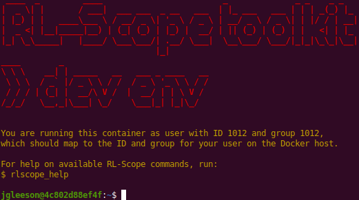

Docker development environment
==============================

In order to run the Docker development environment, you must perform a one-time configuration of your host system.
In particular:

    | :ref:`1. Install docker-compose`: install docker and ``docker-compose``.
    | :ref:`2. NVIDIA driver`: allow non-root users to access GPU hardware counters.
    | :ref:`3. Docker default runtime`: make GPUs available to all containers by default.

After you've configured your host system, you can launch the RL-Scope docker container:

    | :ref:`4. Running the Docker development environment`: build and run the container.

1. Install docker-compose
-------------------------
If your host does not yet have docker installed yet, follow the
`instructions on DockerHub for Ubuntu <https://docs.docker.com/engine/install/ubuntu>`_.

Make sure you are part of the ``docker`` UNIX group:

    .. code-block:: console

        [host]$ sudo usermod -aG docker $USER

NOTE: if you weren't already part of the ``docker`` group,
you will need to logout/login for changes to take effect.

Next, we need to install ``docker-compose``.
To install ``docker-compose`` into :file:`/usr/local/bin/docker-compose`, do the following:

    .. code-block:: console

        [host]$ DOCKER_COMPOSE_INSTALL_VERSION=1.27.4
        [host]$ sudo curl -L "https://github.com/docker/compose/releases/download/${DOCKER_COMPOSE_INSTALL_VERSION}/docker-compose-$(uname -s)-$(uname -m)" -o /usr/local/bin/docker-compose
        [host]$ sudo chmod ugo+rx /usr/local/bin/docker-compose

2. NVIDIA driver
----------------
By default, the ``nvidia`` kernel module doesn't allow non-root users to access GPU hardware counters.
To allow non-root user access, do the following:

1. Paste the following contents into :file:`/etc/modprobe.d/nvidia-profiler.conf`:

    .. code-block:: text

        options nvidia NVreg_RestrictProfilingToAdminUsers=0

2. Reboot the machine for the changes to take effect:

    .. code-block:: console

        [host]$ sudo reboot now

.. warning::
    If you forget to do this, RL-Scope will fail during profiling with an ``CUPTI_ERROR_INSUFFICIENT_PRIVILEGES`` error
    when attempting to read GPU hardware counters.

3. Docker default runtime
-------------------------
By default, GPUs are inaccessible during image builds and within containers launched by :literal:`docker-compose`.
To fix this, we can make ``--runtime=nvidia`` the default for all containers on the host.
To do this, do the following:

1. Stop docker and any running containers:

    .. code-block:: console

        [host]$ sudo service docker stop

2. Paste the following contents into :file:`/etc/docker/daemon.json`:

    .. code-block:: json

        {
          "default-runtime": "nvidia",
          "runtimes": {
            "nvidia": {
              "path": "/usr/bin/nvidia-container-runtime",
              "runtimeArgs": []
            }
          }
        }

3. Restart docker:

    .. code-block:: console

        [host]$ sudo service docker start

4. Running the Docker development environment
---------------------------------------------
The ``run_docker.py`` python script is used for building and running the docker development environment.
In order to run this script on the host, you need to install some minimal "deployment" ``pip`` dependencies (:file:`requirements.docker.txt`).

First, on the **host** run the following (replacing ``[rlscope-root]`` with the directory of your RL-Scope repository):

.. code-block:: console

    # Install python3/virtualenv on host
    [host]$ sudo apt install python3-pip python3-virtualenv

    # Create python3 virtualenv on host
    [host]$ cd [rlscope-root]
    [host]$ python3 -m virtualenv -p /usr/bin/python3 ./venv
    [host]$ source ./venv/bin/activate
    [host (venv)]$ pip install -r requirements.docker.txt

    # Build and run RL-Scope the docker development environment
    [host (venv)]$ cd [rlscope-root]
    [host (venv)]$ python run_docker.py

After the container is built, it will run and you should be greeted with the welcome banner:

If you wish to restart the container in the future, you can do:

.. code-block:: console

    [host]$ cd [rlscope-root]
    [host]$ source ./venv/bin/activate
    [host (venv)]$ python run_docker.py
