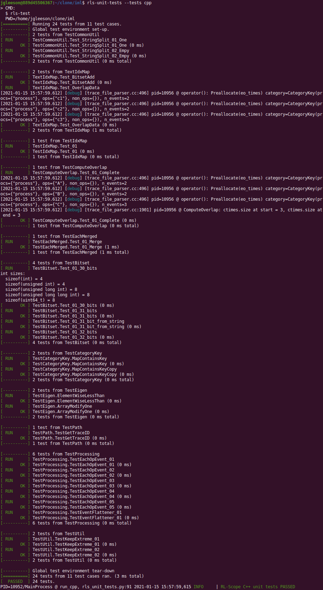
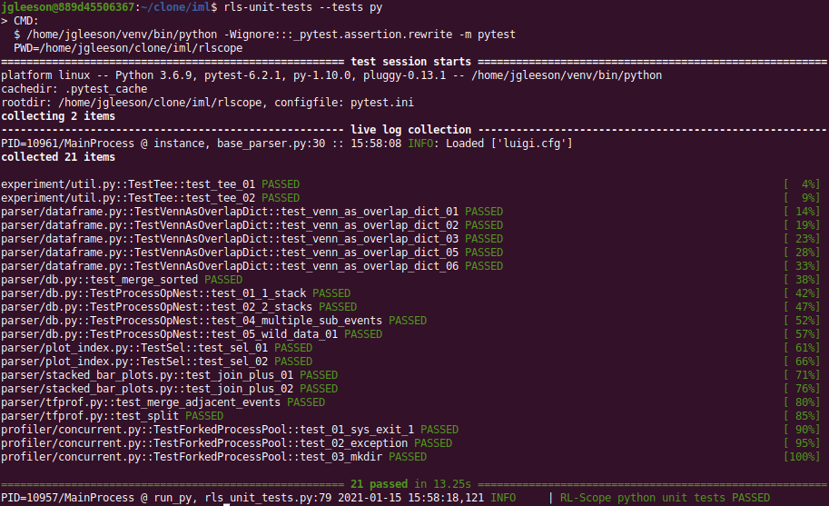

Unit tests
==========

Running unit tests
------------------

RL-Scope has both python and C++ unit tests,
which can be run either separately or all together.

To run all unit tests (i.e., both python and C++):

    .. code-block:: console

        [container]$ rls-unit-tests

To run only C++ unit tests:

    .. code-block:: console

        [container]$ rls-unit-tests --tests cpp

Output should look like:

To run only python unit tests:

    .. code-block:: console

        [container]$ rls-unit-tests --tests py

Output should look like:

Python unit tests
-----------------

Python unit tests made are using the `pytest <https://pytest.org>`_ testing framework.
Unit tests are written in the same module as the function they are testing.
To locate unit tests, search for ``def test_`` in a file.

C++ unit tests
--------------

C++ unit tests are made using the `gtest <https://github.com/google/googletest>`_ testing framework.
Unit tests are any/all files rooted under ``test`` whose filename matches ``test_*.[cc|cpp]``.
All unit tests are compiled into the ``rls-test`` binary.

